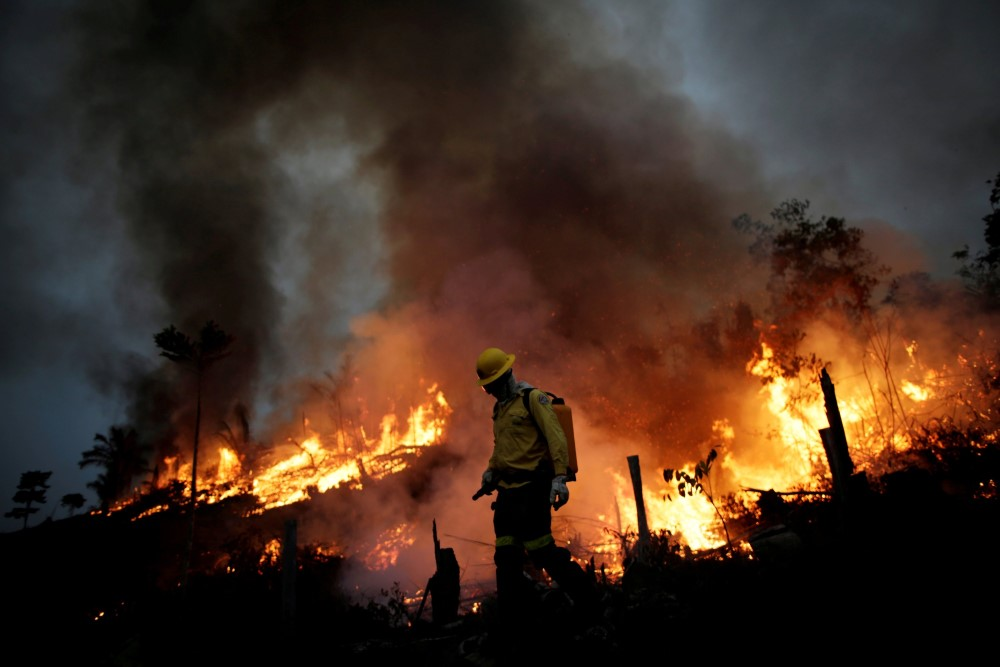
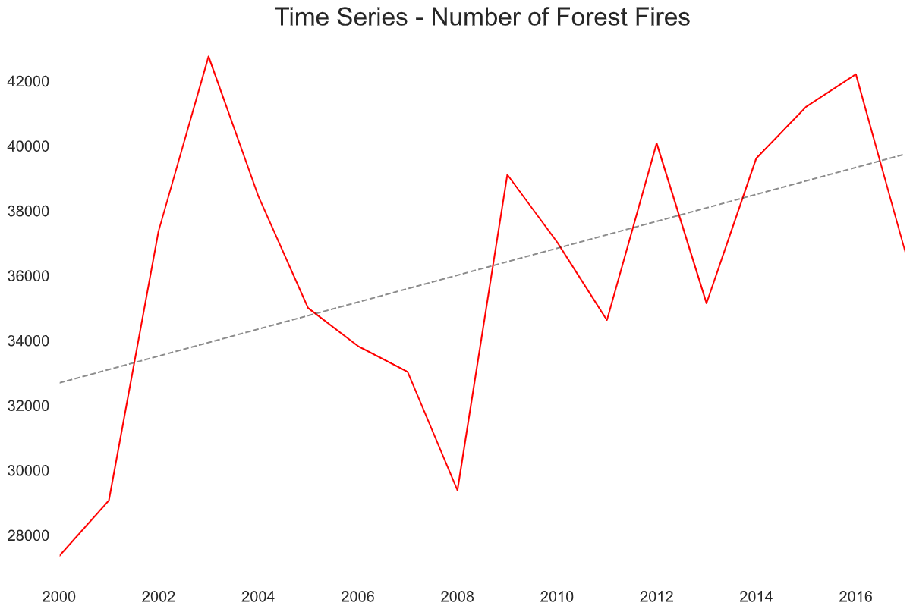
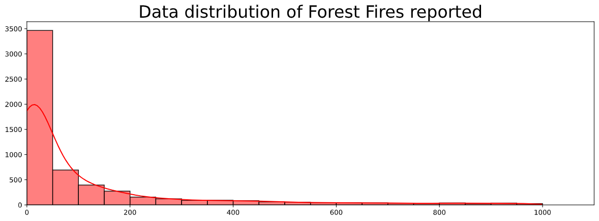
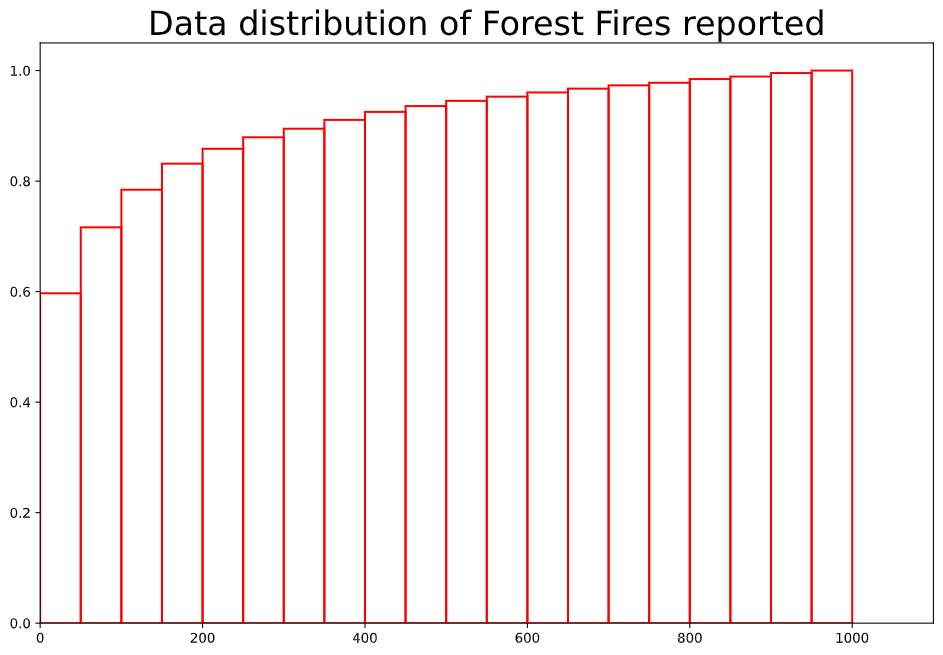
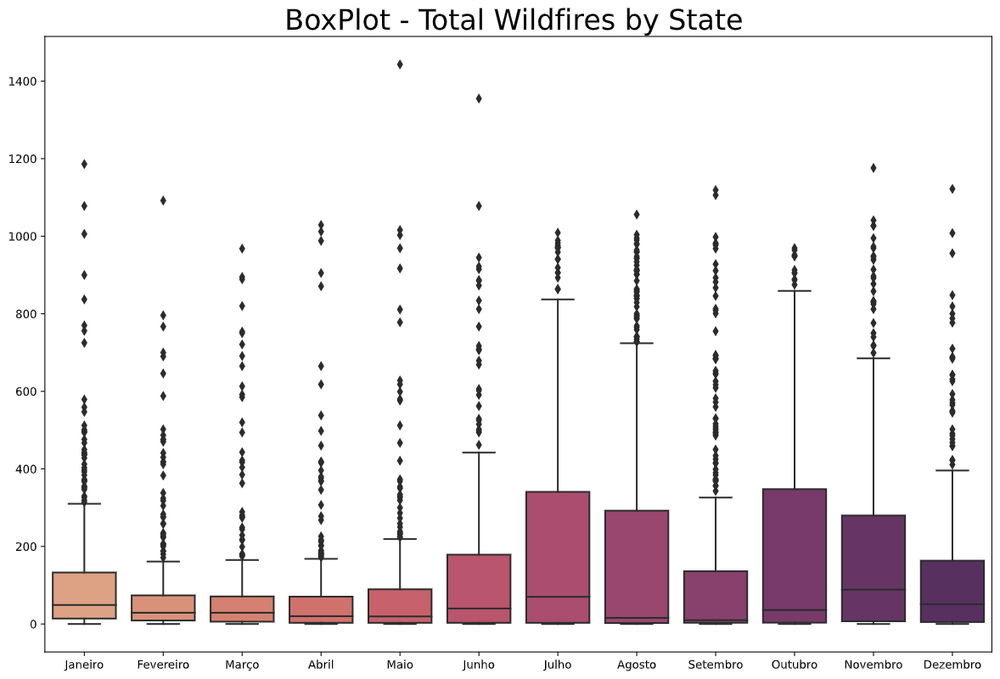
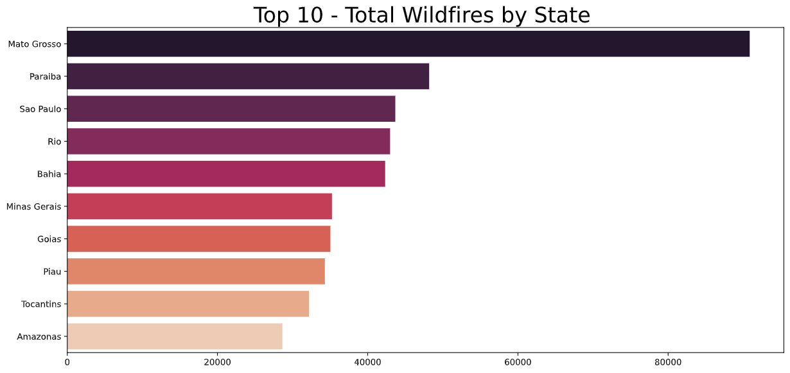

# The never-ending threat in Amazon rainforest

Brief analysis of Amazon Forest fires reported from 1998 to 2017.

The data is a compilation of official government reports and was posted on Kaggle by Luís Gustavo Modelli.

More info here : [Kaggle Dataset](https://www.kaggle.com/gustavomodelli/forest-fires-in-brazil)

Official source : [Brazil Gov Website](http://dados.gov.br/dataset/sistema-nacional-de-informacoes-florestais-snif)



## Introduction

Well, this is not a topic that I'm glad to work with but it is one that **WE** must talk about. I know it is not a funny joke but Fires spreading in Amazon is a "hot" topic every single year and governments from the biggest economies in the world discuss (somehow) methods to deal with it. Brazil authorities have been constantly showing that they can't handle this properly and data presents us with some evidence. I hope that more and more works like this one that consistently show the devastation of Amazon rainforest calls for more public attention, nature will not prevail as long as we just wait for someone (or something...) do what must be done.

Let's dive into it. Thanks for being here.

## Assumptions

We have a dataset that contains the **number of fires reported in Brazil**.Including information by each State, year and month.
While I was looking the data I felt the need to exclude the first two years of measurement because those numbers were relatively too low compared with other years, which suggest the process of collecting the data was not that robust at the time. **So I filtered my dataset to get data from year 2000 or after that**.

## Tools

Language:   Python, always Python.

IDE:        VS Code

## Tables

In every analysis we use techniques and programming to create well-suited tables to help us understand our data quickly. That's the point right now.

I'm gonna show what tables / dataframes I made and the `code` right next to it to help you do the same if necessary.

The whole point is to present some condensed information to shed some light about the data and what are the next steps we should take.


### Original Data

This is the first 5 rows of the dataset just to show what information is in there

```python
import pandas as pd
df = pd.read_csv('./amazon.csv', sep =',', parse_dates = ['date'], encoding = 'latin1')
df.head()
```

|	  |year	  |state	|month	|number	|date      |
|---|:------|:------|:------|:------|:---------|
|0	|1998	|Acre	|Janeiro|	0.0	|1998-01-01|
|1	|1999	|Acre	|Janeiro|	0.0	|1999-01-01|
|2	|2000	|Acre	|Janeiro|	0.0	|2000-01-01|
|3	|2001	|Acre	|Janeiro|	0.0	|2001-01-01|
|4	|2002	|Acre	|Janeiro|	0.0	|2002-01-01|


### Filtered Data

As I mentioned, I want to wrok with data from 2000 or later. Pretty simple but worthy mentioning it.

```python
df = df.query('year >= 2000')
```

Now, this is the data that I'll be using throughout this analysis.

### Data grouped by Year

```python
df_year = (
    df
    .groupby('year')
    .sum('number')
    .reset_index()
    .round(2)
)
```

|	|year	|number|
|---|---|---|
|0	|2000	|27351.25|
|1	|2001	|29071.61|
|2	|2002	|37390.60|
|3	|2003	|42760.67|
|4	|2004	|38453.16|


### Data grouped by State

```python
df_state = (
    df
    .groupby('state')
    .agg(
        fires_reported = ('number', 'sum'),
        mean           = ('number', 'mean'),
        std            = ('number', 'std')
    )
    .sort_values('fires_reported', ascending = False)
    .round(2)
    .reset_index()
)
```

|	|state|fires_reported|mean|std|
|---|---|---|---|---|
|0	|Mato Grosso|	90865.24|	211.31|	254.32|
|1	|Paraiba|	48182.92|	112.05|	174.09|
|2	|Sao Paulo|	43675.99|	203.14|	232.61|
|3	|Rio|	42981.76	|66.64	|117.02|
|4	|Bahia|	42323.96|	196.86	|208.49|

### Data grouped by Region

```python
regions = {
    'Acre': 'Norte',
    'Alagoas': 'Nordeste',
    'Amapa': 'Norte',
    'Amazonas': 'Norte',
    'Bahia': 'Nordeste',
    'Ceara': 'Nordeste',
    'Distrito Federal': 'Centro-Oeste',
    'Espirito Santo': 'Sudeste',
    'Goias': 'Centro-Oeste',
    'Maranhao': 'Nordeste',
    'Mato Grosso': 'Centro-Oeste',
    'Minas Gerais': 'Sudeste',
    'Paraiba': 'Nordeste',
    'Pará': 'Norte',
    'Pernambuco': 'Nordeste',
    'Piau': 'Nordeste',
    'Rio': 'Sudeste',
    'Rondonia': 'Norte',
    'Roraima': 'Norte',
    'Santa Catarina': 'Sul',
    'Sao Paulo': 'Sudeste',
    'Sergipe': 'Nordeste',
    'Tocantins': 'Norte'
}

# Apply map to create column with the regions of each State
df['region'] = df.state.map(regions).astype('string')

# Dataframe grouped by regions
df_regions = (
    df
    .groupby('region')
    .agg(
        num_states       = ('state', 'nunique'),
        num_reports      = ('region', 'count'),
        fires_reported   = ('number', 'sum'),
        avg_per_report   = ('number', 'mean')
    )
    .assign(avg_per_state = lambda df: df.fires_reported.div(df.num_states))
    .sort_values('avg_per_state', ascending = False)
    .round(2)
    .reset_index()
)
```

|    |region  |num_states  |num_reports |fires_reported  |avg_per_report  |avg_per_state|
|---|---|---|---|---|---|---|
|0   |Centro-Oeste |   3|   860 |129312.54|   150.36|  43104.18|
|1   |Sudeste |4   |1290 |   127990.69|   99.22|   31997.67|
|2   |Nordeste  |  8 |1936    |206194.46   |106.51  |25774.31|
|3   |Sul |1   |215 |23936.85    |111.33  |23936.85|
|4   |Norte |  7   |1505    |164592.74   |109.36  |23513.25|

### Summary with statistics

```python
df_stats = (
    df
    .groupby(['year','month','state'])
    .agg(fires_reported = ('number', 'sum'))
    .round(2)
    .reset_index()
)
```

|	|year	|month	    |state	|fires_reported|
|---|---|---|---|---|
|0	|2000	|Janeiro	|Acre	|0.0|
|1	|2000	|Janeiro	|Alagoas	1|1.0|
|2	|2000	|Janeiro	|Amapa	|2.0|
|3	|2000	|Janeiro	|Amazonas	|7.0|
|4	|2000	|Janeiro	|Bahia	|31.0|
|5	|2000	|Janeiro	|Ceara	|1.0|
|6	|2000	|Janeiro	|Distrito Federal	|0.0|
|7	|2000	|Janeiro	|Espirito Santo	|5.0|
|8	|2000	|Janeiro	|Goias	|10.0|
|9	|2000	|Janeiro	|Maranhao	|19.0|

## Charts and Insights

Usually, I like to analyze any set of information using the "top-down" approach where the first visualizations must be from a macro perspective. From that it will help a lot as we try to fully understand all variables and their relationship (if any), this is my approach but you may go the way you feel more comfortable with.

First question that came to my mind was "Is wildfires increasing over time?" and "What's the trend?". A single line chart can easily answer this but I decided to add a little line which represents the trend instead of use my "visual skills" to determine it.

Despite the number of wildfires decreasing after huge increases, the trend shows an upward movement which is what we are most concerned.



Now let´s look at the distribution of reports of wildfires. When working with `seaborn.histplot` there is a parameter "binwidth" which you can increase/decrease the width of each bar of the distribution, in this case I use "binwidth = 50" but it is up to you to change it.

We have a "right-skewed" distribution where roughly 80% the reports were 200 wildfires or less.


---


One aspect that is worth looking for more details is sazonality, differences in climate over the year or economic events may influence the amount of fires. A boxplot grouped by month may give some hint.



Historically, months like July, October and November are the ones with more reports of forest fires but one thing is interesting here. The second half of the year is way more relevant and critical then the first half. Probably one reason that supports that result is brazil's climate where the decline in precipitation (a.k.a. rain) and increase in the average temperature starting in June, the chart below from Hikersbay website helps a lot to understand it.

> **Rule of thumb **: Less precipitation + Higher temperatures = Perfect scenario for fires


Next step that we can dig a little more is compare fires across States. Since I am brazilian I know these States are divided in geographical regions and include another level to our analysis. Theses regions were created to group diferent States with similarities in aspects like economic drivers, climate and so on.

First, a horizontal barplot to display each brazilian region and the number of forest fires reported. The "Centro-Oeste" (english: Middle-West) region has the majority of reports in the dataset. 


Then, we break it down into States to find which States in Brazil has the most number of forest fires. Brazil has 26 states in total and it would be too much data to show in a single chart. That being said, I'm gonna display the top 10 to clean a little a bit our visualization.



# Final thoughts

**Mato Grosso** is the third biggest Brazilian State in area (estimated: 903,357 km²) and it is famous by its Fauna and Flora. Pantanal is the heart of the State and its importance is recognized by UNESCO on its website (https://whc.unesco.org/en/list/999/)

Sadly, it faces the threat more than any other State up until now that (as I'm writing this project) we are entering the second half of 2021 where forest fires are more frequent historically. We do not have all the data we wanted but with what we got is enough to tell us the urgency of the matter.

Thanks for sticking with me.

Have a nice day.
